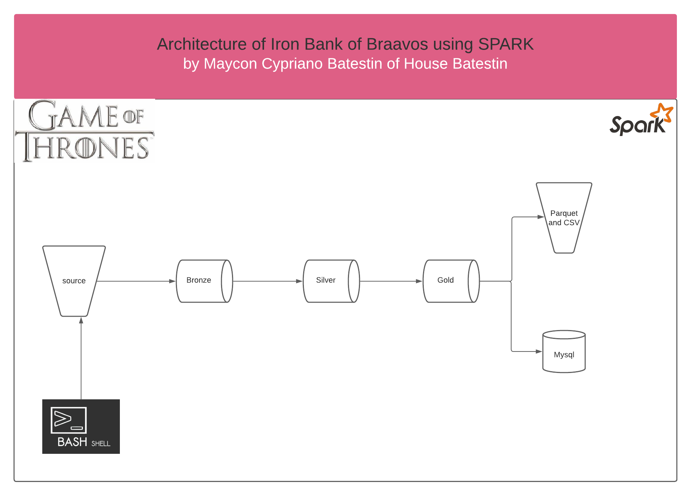

<h1 align="center">

<h3> 
ETL WITH SPARK SIMULATION OF IRON BANK OF BRAAVOS 
 </h3>
<h3> 
 ================= 
 </h3>

>> <h3> Solution Architecture </h3>

>> <h3> Glossary of Data </h3>

Glossary
-----------------

Fields	                                                  | Type  	  |    Description                              |
----------------------------------------------------------|:---------:|:-------------------------------------------:|
first_name                  							  |string 	  | name of client                              |
itin													  |string     | The ITIN number is a tax processing number  |
family													  |string     | name of the family to which it belongs      |
house													  |string     | name of the house to which it belongs       |
words													  |string     | motto to live by                            |
title													  |string     | title to refer                              |
gender													  |string     | gender                                      |
date_birth												  |string     | date of birth                               |
faith													  |string     | dominant religion                           |
god_to_pray												  |string     | God who reveres                             |
postalcode												  |string     | postalcode                                  |
street													  |string     | street name informed                        |
number													  |string     | number of street name informed              |
birth_culture   										  |string     | culture that which was baptized             |
country_of_birth										  |string     | country of birth                            |
city_of_birth											  |string     | city of birth                               |
current_culture											  |string     | recently chosen culture                     |
currency_city											  |string     | recently city                               |
rent_income_value										  |string     | amount you got from the bank                |
description_chosen_income_method	    				  |string     | negative or positive value of your income   |
total_account_value										  |string     | total amount your account can reach         |
current_account_total_value								  |string     | amount your account is currently            |
total_amount_carried_over								  |string     | total amount carried over                   |
bank													  |string     | name of the Bank                            |
account_type											  |string     | type of account bank                        |
investor_profile										  |string     | investor profile analysis                   |
account_status											  |string     | status of account                           |
bban_count												  |string     | basic bank account number                   |
aba														  |string     | bank identification code                    |
total_limit_value										  |string     | total value limit                           |
limit_value_available									  |string     | limit value available for use               |
total_limit_used										  |string     | limit value used                            |
description_card										  |string     | type of card                                |
security_card											  |string     | security code of card                       |
expire_card_numbe										  |string     | card expiration date                        |
status_account_blocked									  |string     | Card Lock Status                            |
transaction_code										  |string     | Number entered in card transaction          |
date_transaction										  |string     | date of transaction card                    |
time_transaction										  |string     | time of transaction card                    |
describle_transaction									  |string     | purchased product or service                |
original_transaction_amount								  |string     | value of the purchased product              |
number_installments_assign								  |string     | number installments assign	                |
current_installment										  |string     | current installment          			    |
currency												  |string     | currency used in transaction	            |
yearmonthday											  |string     | date of transaction carried out	            |

Description
------------

 BRAAVOS IRON BANK is the only bank belonging to the great world of the Chronicles of Fire and Ice. In this project, we simulate the advancement of this fictitious society without altering natural elements of its world. There are the information that characterize the Chronicles, such as WESTEROS, WINTERFELL, ESSOS. Its inhabitants have common characteristics. They all have an ITIN, and have their home's mottos as a social orientation, but what they have most in common is that they all use the BRAAVOS IRON BENCH.
Here you will find all your transactions, products or services purchased, loans, investor profile, etc.
The project has a run.sh execution file that when initialized asks the amount of records you want to get (yes, you can simulate the desired amount of data mass) and after that a series of transformations occurs with the data.
They will first be sent to a folder called BRONZE where it will undergo deduplication changes to be populated in the SILVER folder and thus be able to become the real data in the GOLD folder.
O projeto segue o organograma funcional de qualquer banco digital contemporâneo. Ele pode ser adaptado para plataformas em nuvens, ou rodar localmente, que é o caso a qual disponho neste repositório.
Hope you like it!
Enjoy the project.
